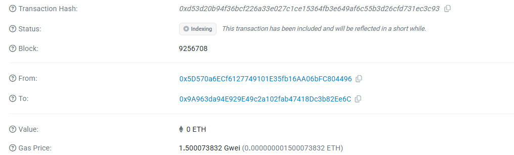

# Private Age Verification

A revolutionary privacy-preserving age verification system built on blockchain technology using Fully Homomorphic Encryption (FHE). This application enables secure age verification without revealing personal information or actual age data.

## 🌟 Live Demo

**Website**: [https://private-age-verification.vercel.app/](https://private-age-verification.vercel.app/)

**GitHub Repository**: [https://github.com/GarlandKohler/PrivateAgeVerification](https://github.com/GarlandKohler/PrivateAgeVerification)

## 🎯 Core Concepts

### FHE Contracts
This project leverages **Fully Homomorphic Encryption (FHE)** smart contracts powered by Zama's technology. FHE allows computations to be performed on encrypted data without ever decrypting it, ensuring complete privacy throughout the verification process.

### Confidential Age Verification - Privacy Age Check
Our innovative approach to age verification ensures:
- **Zero Knowledge Disclosure**: Your actual age is never revealed
- **Encrypted Computation**: All age comparisons happen on encrypted data
- **Blockchain Security**: Immutable verification records on the blockchain
- **Privacy First**: No personal data storage or transmission

## 🔧 Technical Architecture

### Smart Contract
The system utilizes FHE-enabled smart contracts that can perform age comparisons on encrypted age data. The contract only returns a boolean result (eligible/not eligible) without exposing the actual age.

### Encryption Process
1. User's age is encrypted using FHE on the client side
2. Encrypted age data is sent to the smart contract
3. Contract performs comparison against minimum age requirement (encrypted)
4. Boolean result is returned without decrypting the age data

## 📱 Features

- **🔒 Privacy-Preserving**: Complete anonymity during verification
- **⚡ Instant Verification**: Real-time age checking
- **🌐 Decentralized**: Built on blockchain infrastructure
- **🛡️ Secure**: Military-grade encryption standards
- **📱 User-Friendly**: Simple and intuitive interface
- **🔗 Transparent**: Open-source and auditable

## 🎥 Demo Materials

### Demo Video

*Complete walkthrough of the age verification process showcasing the privacy-preserving features*

### Age Verification Interface

*Clean and user-friendly interface for secure age submission*

## 🌍 Contract Addresses

### Sepolia Testnet
- **Main Contract**: `0x9A963da94E929E49c2a102fab47418Dc3b82Ee6C`

*Contract is deployed and verified on Sepolia testnet*

## 🚀 How It Works

1. **Connect Wallet**: Link your Web3 wallet to the application
2. **Enter Age**: Input your age in the secure form
3. **Encryption**: Your age is automatically encrypted using FHE
4. **Verification**: Encrypted data is processed by smart contract
5. **Result**: Receive verification status without age disclosure

## 🔐 Privacy Guarantees

- **No Age Storage**: Your actual age is never stored anywhere
- **No Data Transmission**: Encrypted data only, never plain text
- **No Third-Party Access**: Decentralized verification process
- **No Tracking**: Anonymous verification system

## 🌟 Use Cases

- **Digital Content Access**: Age-gated content verification
- **Online Services**: Account creation with age requirements
- **E-commerce**: Age-restricted product purchases
- **Gaming Platforms**: Age-appropriate game access
- **Financial Services**: Age verification for financial products

## 🛠️ Technology Stack

- **Frontend**: Vanilla JavaScript, HTML5, CSS3
- **Blockchain**: Ethereum, Sepolia Testnet
- **Encryption**: Zama FHE Technology
- **Web3**: Ethers.js
- **Smart Contracts**: Solidity with FHE extensions

## 📊 Benefits

### For Users
- Complete privacy protection
- No personal data exposure
- Instant verification results
- Decentralized control

### For Businesses
- Regulatory compliance
- Reduced liability
- Enhanced user trust
- Scalable solution

## 🔮 Future Enhancements

- Cross-chain compatibility
- Mobile application
- Enterprise API
- Advanced analytics dashboard
- Multi-language support

## 🤝 Contributing

We welcome contributions from the community! This is an open-source project aimed at advancing privacy-preserving technologies.

## 📞 Support

For technical support or questions about the project, please visit our GitHub repository or contact us through the provided channels.

---

**Private Age Verification** - Protecting privacy while ensuring compliance in the digital age.